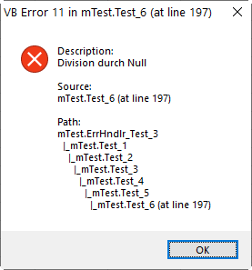
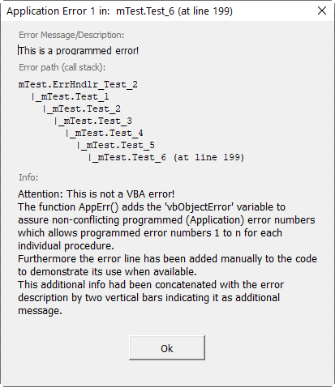

# Common VBA Error Handler
### Introduction
At first this implementation of an error handling may look as a kind of overkill. However it is an enormous time saver for the investigation and elimination of coding errors as well as for any performance flaws. The error handling approach significantly differs between development/test and production. During development and test the following very basic approach may suffice:
```vbscript
Private Sub Any
   On Error Go-to on_error
   ....
   
exit_proc:
   Exit Sub
   
on_error:
#If Debugging Then ' to be turned off in production!
   Debug.Print Err.Description: Stop: Resume
#End If
End Sub
```
The error description is printed in the VBE immediate window and execution stops allowing to manually resume the line of code which caused the error. A true "godsend" allowing to eliminate the cause for the error on the fly.

One may be tempted to stop here having experienced the enormous benefit of this simple kind of error handling. But perfectly suited for development and test is it absolutely inappropriate in production - except you the developer are the only user. And that's why it can be turned off by the Conditional Compile Argument ```Debugging=0```. Implementing the full error handling approach offers not only a user friendly error message but also - with very little effort - the means to trace the execution time to find and solve performance flaws.

#### Production
When the [_Entry Procedure_](#the-entry-procedure) is known, the error is passed on back up to it and finally displays a message with:
- A title which considers whether it is an _Application Error_ or a _Visual Basic Run Time Error_ in the form<br>Application|VB error [number] in <module>.<procedure> [at line <line number>] 
- The _Error Description_ which is either the description of the _Visual Basic Run Time Error_ (```Err.Description```) or the description of the error provided by means of the ```Err.Raise``` statement 
- The _Error Path_ (provided the [_Entry Procedure_](#the-entry-procedure) is known) indicating the call stack from the procedure where the error occurred (the _Error Source_ back up to the [_Entry Procedure_](#the-entry-procedure)

Provided the  Conditional Compile Argument _ExecTrace=1_, each time an _Entry Procedure_ is reached, the _Execution Trace_  including the _Execution Time_ of each [traced procedure](#execution-traced-procedures) is printed in the VBE immediate window.

Note: When the [_Entry Procedure_](#the-entry-procedure) is unknown  the error is immediately displayed in the procedure where the error occurred or in the first calling procedure which has an ```On Error Goto ...``` statement.

### Installation
Download and import to you VBA project:
- Download and import [_mErrHndlr_](https://www.dropbox.com/s/jwr22mfp4rrdo0a/mErrHndlr.bas?dl=1)
- Download and import [_clsCallStack_](https://www.dropbox.com/s/43enzf4bb3797ix/clsCallStack.cls?dl=1)
- Download and import [_clsCallStackItem_](https://www.dropbox.com/s/sj3bj3zrhsm5itx/clsCallStackItem.cls?dl=1)

Only in case you want to use a more appealing kind of error message (see the [difference in the display](#difference-in-display-of-the-error-message)):
- Download [fMsg.frm](https://www.dropbox.com/s/qc9kuqlah5tziov/fMsg.frm?dl=1) and [fMsg.frx](https://www.dropbox.com/s/ceisq7azcj5zsx0/fMsg.frx?dl=1) and import _fMsg.frm_
Set the local Conditional Compile Argument in the mErrHndlr module
```vbscript
#Const AlternateMsgBox = 0  ' 1 = Error displayed by means of the Alternative VBA MsgBox fMsg
                            ' 0 = Error displayed by means of the original VBA MsgBox
```

### Usage
1. The identification of the _Entry Procedure_ is crucial for some of the key features of the _Common VBA Error Handler_. It only requires a BoP Begin of Procedure and an EoP (End of Procedure statement.
2. The identification of the _Error Source_ requires a ```Const PROC ="...." ``` statement in each procedure which has an ```On Error Goto on_error``` statement and the following function copied into the module:
```vbscript
Private Property Get ErrSrc(Optional ByVal s As String) As String:  ErrSrc = "<modulename>." & s:   End Property
```
The code for the usage of the _Common VBA Error Handler_  (in a procedure with an ```On Error Goto on_error``` statement will look as follows:

```vbscript
Private Sub Any

   On Error Goto on_error
   Const PROC = "Any" ' identifies this procedure as error source in case
   BoP ErrSrc(PROC) ' Begin of procedure, mandatory in an "entry procedure"
   
   <any code> ' remember not using "Exit Sub" but "Goto exit_proc" in case
   
exit_proc:
   EoP ErrSrc(PROC) ' End of procedure, mandatory in an "entry procedure"
   Exit Sub
   
on_error:
#If Debugging Then
   Debug.Print Err.Description: Stop: Resume
#End If
   mErrHndlr.ErrHndlr Err.Number, ErrSrc(PROC), Err.Description, Erl
End Sub
```
#### Execution traced procedures
Any procedure with an BoP/EoP statement will be included in the trace of its execution - provided the Conditional Compile Argument ExecTrace=1 - and the result will be displayed in the VBE immediate window whenever the execution returns to an _Entry Procedure_.

Example:


#### Difference in display of the error message
##### Using the VB MsgBox

##### Using the Alternative VB MsgBox


#### 